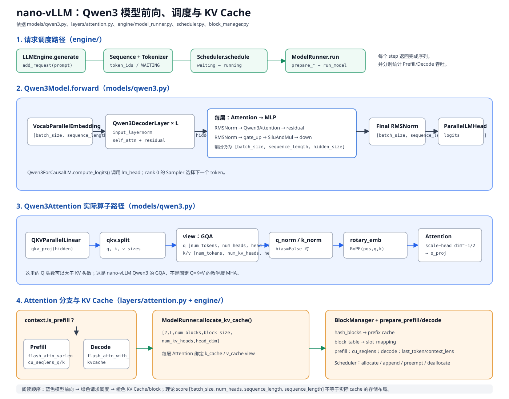

# 第 06 课｜L2.1：Transformer、Q/K/V 与 Attention Tensor Shape
https://www.zhihu.com/question/445556653/answer/3254012065
https://zhuanlan.zhihu.com/p/647130255
## 一、学习目标

完成本课后，你应能：

1. 说明 Transformer Attention 中 Q、K、V 的作用；
2. 使用 `batch_size、sequence_length、hidden_size、num_heads、head_dim` 表示常见 Tensor shape；
3. 推导 Q/K/V、attention score 和 attention output 的 shape；
4. 理解为什么 Attention 的 score 矩阵会随序列长度平方增长；
5. 为后续 MHA、MQA、GQA、KV Cache 和长上下文优化打基础。

---

## 二、五个必须记住的英文全称

| 英文全称 | 含义 | 示例 |
|---|---|---|
| batch_size | batch size，一次处理多少条序列 | 2 |
| sequence_length | sequence length，序列中 token 数 | 128 |
| hidden_size | hidden size，总隐藏维度 | 768 |
| num_heads | attention head 数 | 12 |
| head_dim | 每个 head 的维度 | 64 |

通常：

```text
hidden_size = num_heads × head_dim
```

例如 `768 = 12 × 64`。

---

## 三、先看完整网络：Decoder-only Transformer 在做什么

对应 nano-vLLM 实际代码的结构图：



图中蓝色部分是 `models/qwen3.py` 的模型前向，绿色部分是 `engine/llm_engine.py`、`scheduler.py` 和 `model_runner.py` 的请求路径，橙色部分是 `layers/attention.py` 与 `block_manager.py` 的 KV Cache/block 管理。

在进入 Q/K/V 之前，先把一层语言模型放回完整数据流中。以常见的 decoder-only LLM 为例：

```text
文本
  │
  ▼
Tokenizer
  │  token ids: [batch_size, sequence_length]
  ▼
Token Embedding + Position Information（RoPE 通常在 Attention 内注入）
  │  hidden states X: [batch_size, sequence_length, hidden_size]
  ▼
┌──────────────── Transformer Block × num_layers ───────────────┐
│                                                               │
│  RMSNorm → QKV 投影 → 拆分 Attention Heads → RoPE              │
│                              │                                │
│                              ▼                                │
│                   QKᵀ / √head_dim → Causal Mask                     │
│                              │                                │
│                         Softmax → ×V                          │
│                              │                                │
│               输出投影 → Residual Add                         │
│                              │                                │
│                    RMSNorm → SwiGLU/MLP                       │
│                              │                                │
│                        Residual Add                            │
└───────────────────────────────────────────────────────────────┘
  │  hidden states: [batch_size, sequence_length, hidden_size]
  ▼
Final RMSNorm → LM Head（映射到词表）
  │  logits: [batch_size, sequence_length, vocabulary_size]
  ▼
取最后位置 logits[:, -1, :] → 采样/贪心 → 下一个 token
```

这里的 `num_layers` 是 Transformer block 层数，`vocabulary_size` 是词表大小。**本课只放大其中的 Attention 子图**；RMSNorm、SwiGLU、残差和 LM Head 先建立位置感，后续再分别展开。

### 3.1 一层 Transformer Block 的两条残差支路

可以把一层理解成“先混合 token 之间的信息，再独立加工每个 token 的通道”：

```text
X [batch_size, sequence_length, hidden_size]
 │
 ├── RMSNorm → Self-Attention → (+ X) ──► Y [batch_size, sequence_length, hidden_size]
 │                                      │
 │                                      └── RMSNorm → SwiGLU/MLP → (+ Y)
 │                                                               │
 └───────────────────────────────────────────────────────────────► Z [batch_size, sequence_length, hidden_size]
```

- Self-Attention 沿着 `sequence_length` 维度让当前位置读取上下文中的其他 token；
- SwiGLU/MLP 对每个 `[hidden_size]` 向量独立做通道变换，不直接混合不同 token；
- 两次 Residual Add 保持输入输出都是 `[batch_size, sequence_length, hidden_size]`，使很多层可以稳定堆叠。

### 3.2 Attention 子图：`hidden_size` 如何变成 `num_heads×head_dim`

```text
X [batch_size, sequence_length, hidden_size]
 │
 ├─ Wq ─► Q [batch_size, sequence_length, hidden_size] ─► reshape/transpose ─► [batch_size, num_heads, sequence_length, head_dim]
 ├─ Wk ─► K [batch_size, sequence_length, hidden_size] ─► reshape/transpose ─► [batch_size, num_heads, sequence_length, head_dim]
 └─ Wv ─► V [batch_size, sequence_length, hidden_size] ─► reshape/transpose ─► [batch_size, num_heads, sequence_length, head_dim]

Q [batch_size, num_heads, sequence_length, head_dim] × Kᵀ [batch_size, num_heads, head_dim, sequence_length]
                 │
                 ▼
          scores [batch_size, num_heads, sequence_length, sequence_length]
                 │ causal mask + softmax
                 ▼
          weights [batch_size, num_heads, sequence_length, sequence_length] × V [batch_size, num_heads, sequence_length, head_dim]
                 │
                 ▼
          head output [batch_size, num_heads, sequence_length, head_dim]
                 │ merge num_heads×head_dim
                 ▼
          [batch_size, sequence_length, hidden_size] → Wo → Attention output [batch_size, sequence_length, hidden_size]
```

因此 `hidden_size=num_heads×head_dim` 不是孤立的记忆公式，而是“一个 hidden vector 被切成 num_heads 个 head，每个 head 取 head_dim 个通道”的网络结构约束。

### 3.3 训练、Prefill 与 Decode 看到的网络有什么不同

网络结构相同，输入的 token 范围不同：

```text
训练：   一次输入整段序列，所有位置并行计算，使用 causal mask
Prefill：一次输入完整 prompt，建立整段 K/V Cache
Decode： 每步通常只输入 1 个新 token，读取历史 K/V Cache，生成下一个 token
```

```text
Prefill:
  prompt [batch_size, sequence_length] → Embedding → 多层 Block → logits [batch_size, sequence_length, vocabulary_size]
                                      └→ 保存 K/V Cache

Decode 第 t 步:
  new token [batch_size, 1] + position t
      → Embedding → 多层 Block
                    ├→ 新 Q 与历史 K/V 做 Attention
                    └→ 追加新的 K/V Cache
      → logits [batch_size, 1, vocabulary_size] → 下一个 token
```

这解释了后面会反复出现的两个工程事实：Prefill 更接近大矩阵计算，Decode 更频繁地读取 KV Cache；`scores` 的理论 shape 仍可用 `[batch_size, num_heads, sequence_length, sequence_length]` 理解，但工程实现会用 Flash Attention 和 Cache 专用路径避免显式保存完整矩阵。

---

## 四、Q、K、V 是什么

输入 hidden state 的 shape 通常是：

```text
X: [batch_size, sequence_length, hidden_size]
```

经过三组线性投影得到：

```text
Q = X × Wq
K = X × Wk
V = X × Wv
```

投影后初始 shape 仍可写成：

```text
Q, K, V: [batch_size, sequence_length, hidden_size]
```

再拆成多个 attention head：

```text
[batch_size, sequence_length, hidden_size]
→ [batch_size, sequence_length, num_heads, head_dim]
→ transpose
→ [batch_size, num_heads, sequence_length, head_dim]
```

直观上：

- Q（Query）表示当前 token 想查询什么；
- K（Key）表示每个 token 可被匹配的特征；
- V（Value）表示被关注后实际取回的信息。

---

## 五、Attention 的 shape 推导

每个 head 内计算：

```text
scores = Q × Kᵀ / sqrt(head_dim)
```

Q 是 `[batch_size, num_heads, sequence_length, head_dim]`，K 转置后最后两维是 `[head_dim, sequence_length]`，因此：

```text
scores: [batch_size, num_heads, sequence_length, sequence_length]
```

最后两个 `sequence_length` 的含义分别是：

```text
query token 位置 × key token 位置
```

对 score 做 softmax 后，shape 不变：

```text
P = softmax(scores): [batch_size, num_heads, sequence_length, sequence_length]
```

再与 V 相乘：

```text
output = P × V
[batch_size, num_heads, sequence_length, sequence_length] × [batch_size, num_heads, sequence_length, head_dim]
→ [batch_size, num_heads, sequence_length, head_dim]
```

将 head 合并后：

```text
[batch_size, num_heads, sequence_length, head_dim]
→ transpose → [batch_size, sequence_length, num_heads, head_dim]
→ reshape → [batch_size, sequence_length, hidden_size]
```

---

## 六、为什么长序列 Attention 很贵

score 的 shape 是 `[batch_size, num_heads, sequence_length, sequence_length]`。当序列长度从 `sequence_length` 变成 `2×sequence_length` 时，score 元素数量从 `sequence_length²` 变为 `(2S)²=4S²`。

这也是长上下文训练和 Prefill 阶段的主要计算/显存挑战之一。后续会学习 KV Cache、GQA 和 PagedAttention 如何缓解其中一部分成本。

---

## 七、带做例题

设：

```text
batch_size = 2
sequence_length = 128
hidden_size = 768
num_heads = 12
head_dim = 64
```

则：

```text
X:      [2, 128, 768]
Q/K/V:  [2, 128, 768]
split:  [2, 128, 12, 64]
Q/K/V:  [2, 12, 128, 64]
scores: [2, 12, 128, 128]
output: [2, 12, 128, 64]
merge:  [2, 128, 768]
```

---

## 八、常见 shape 错误

| 现象 | 常见原因 |
|---|---|
| `hidden_size` 无法拆为 `num_heads×head_dim` | head 数与 head dim 配置不匹配 |
| Q 与 K 矩阵乘法报错 | 转置维度错误，最后两维不是 `[sequence_length, head_dim] × [head_dim, sequence_length]` |
| attention mask 广播失败 | mask 的 `[batch_size, 1, sequence_length, sequence_length]` 与 score 的 `[batch_size, num_heads, sequence_length, sequence_length]` 不兼容 |
| 显存突然增大 | score `[batch_size, num_heads, sequence_length, sequence_length]` 随 sequence_length 的平方增长 |

---

## 九、本课练习

### 第 1 题｜维度关系

若 `hidden_size=1024`、`num_heads=16`，每个 head 的维度 `head_dim` 是多少？

**我的回答：**
head_dim=64

**批改：正确。**

```text
head_dim = hidden_size / num_heads = 1024 / 16 = 64
```

### 第 2 题｜Q/K/V shape

`batch_size=4`、`sequence_length=64`、`hidden_size=512`、`num_heads=8`。拆分并转置后，Q 的 shape 是什么？

**我的回答：**
题目条件不清楚，直接帮我作答

**批改：未完成。** 条件已经足够，需要先拆分再转置：

```text
Q 投影后：       [4, 64, 512]
拆成 8 个 head： [4, 64, 8, 64]
transpose(1,2)：  [4, 8, 64, 64]
```

### 第 3 题｜score shape

沿用第 2 题，attention score 的 shape 是什么？

**我的回答：**
和输入 hidden state 的形状一样 `batch_size sequence_length hidden_size`？

**批改：错误。** score 表示每个 query 位置和每个 key 位置之间的分数，不再保留 `hidden_size=512`，正确 shape 是：

```text
Q:       [4, 8, 64, 64]
Kᵀ:      [4, 8, 64, 64]  # 最后两维理解为 [head_dim, sequence_length] 后参与矩阵乘法
scores:  [4, 8, 64, 64]
```

最后两个 `64` 分别是 query token 位置和 key token 位置。

### 第 4 题｜长序列

若 sequence_length 从 256 增至 512，score 矩阵元素数量变为原来的几倍？为什么？

**我的回答：**
4倍，Q乘K的转置过程中sequence_length*sequence_length

**批改：正确。** `sequence_length` 变为 2 倍时，score 的两个序列维度都变为 2 倍，所以元素数量变为 `2×2=4` 倍。

## 十、通过标准

- 能从 `hidden_size=num_heads×head_dim` 推导 head dim；
- 能写出 Q/K/V 和 score 的 shape；
- 能解释 score 随 sequence_length² 增长的原因。

完成后先做章节评估；未达标时只在本文追加夯实内容。下一课学习 MHA、MQA、GQA 与 KV Cache。

---

## 十一、代码结合练习（不运行模型）

本节的代码路线和后续工具映射见 `AI_NPU代码结合学习地图.md`。完成前面四道 shape 题后，再用下面的观察卡把公式连接到实现；只需阅读，不修改或执行任何外部项目。

阅读顺序：

1. CS336 笔记：`llm_learning/cs336_note_and_hw-main/课后笔记/05_Attention.md`；
2. nano-vLLM：`llm_learning/nano-vllm/nanovllm/models/qwen3.py` 与 `llm_learning/nano-vllm/nanovllm/layers/attention.py`；
3. ModelZoo：`llm_learning/houmo-examples-xh2/apis/inferences/qwen3/README.MD`。

### L2.1 代码观察卡

```markdown
- QKV 在 nano-vLLM 中的切分位置：不知，这里补充上建议代码实现并讲解
- RoPE 应用于：不知道  给出建议代码实现并讲解
- Prefill 与 decode 的 Attention 路径分别是：不知道  给出建议代码实现并讲解
- `scores [batch_size, num_heads, sequence_length, sequence_length]` 在工程实现中为什么不显式长期保存在 HBM：因为会更新吖
```

提示：先找 `qkv.split(...)`、RoPE 调用和 `context.is_prefill` 分支。最后一题的关键词是 Flash Attention 的分块计算与避免把完整 score 矩阵写回高带宽内存。

---

## 十二、本轮批改与夯实

本轮核心题独立完成情况为 2/4；第 2、3 题都集中在“拆头后最后两维”和“score 的两个 sequence_length”上，所以本节暂不通过，先做下面的夯实。

### 12.1 用一个最小例子固定三种 shape

设 `batch_size=1、sequence_length=3、hidden_size=8、num_heads=2、head_dim=4`：

```text
X                         [1, 3, 8]
Q/K/V 投影后               [1, 3, 8]
view 成 head               [1, 3, 2, 4]
transpose(1, 2)            [1, 2, 3, 4]
Q × Kᵀ                     [1, 2, 3, 3]
softmax 后                 [1, 2, 3, 3]
attention weights × V      [1, 2, 3, 4] # V=[1, 2, 3, 4]
merge heads                [1, 3, 8]
```

记忆方法：

```text
[batch_size, sequence_length, hidden_size]       是 token 表示；
[batch_size, num_heads, sequence_length, head_dim]     是按 head 排列的 Q/K/V；
[batch_size, num_heads, sequence_length, sequence_length]     是 token 位置对 token 位置的关系，不是 hidden 表示。
```

### 12.2 代码观察卡标准答案

#### QKV 在哪里切分

文件：`llm_learning/nano-vllm/nanovllm/models/qwen3.py`，`Qwen3Attention.forward`：

```python
qkv = self.qkv_proj(hidden_states)
q, k, v = qkv.split([self.q_size, self.kv_size, self.kv_size], dim=-1)
q = q.view(-1, self.num_heads, self.head_dim)
k = k.view(-1, self.num_kv_heads, self.head_dim)
v = v.view(-1, self.num_kv_heads, self.head_dim)
```

注意这里是 GQA：`num_heads` 可以大于 `num_kv_heads`。因此不能机械地认为 Q、K、V 的 head 数一定相同。

#### RoPE 应用在哪里

同一个 `forward` 中：

```python
q, k = self.rotary_emb(positions, q, k)
```

RoPE 作用于 Q 和 K，不作用于 V。它用 `positions` 将位置信息旋转进 Q/K，使注意力分数携带相对位置信息。

#### Prefill 与 Decode 的实际路径

文件：`llm_learning/nano-vllm/nanovllm/layers/attention.py`：

```python
if context.is_prefill:
    o = flash_attn_varlen_func(...)
else:
    o = flash_attn_with_kvcache(...)
```

其中 `ModelRunner.run` 在 `model_runner.py` 中通过：

```python
input_ids, positions = (
    self.prepare_prefill(seqs) if is_prefill else self.prepare_decode(seqs)
)
```

选择输入准备路径。Prefill 处理 prompt 的一段或多段 token；Decode 通常每条序列只处理最新的一个 token，并读取历史 KV Cache。

#### 为什么不长期保存完整 `scores [batch_size, num_heads, sequence_length, sequence_length]`

“因为会更新”不是主要原因。正确原因是：完整 score 矩阵的大小随 `sequence_length²` 增长，若写回 HBM，会产生很大的显存占用和读写流量。Flash Attention 使用分块计算，在片上存储中逐块完成 `QKᵀ → softmax → V`，只保留必要的中间结果和输出，避免长期保存完整 score 矩阵。

### 12.3 第一次复测

1. `batch_size=2、sequence_length=16、hidden_size=256、num_heads=8` 时，`head_dim` 是多少？
答：46

**批改：错误。** `head_dim=hidden_size/num_heads=256/8=32`。这里不需要使用 `batch_size` 和 `sequence_length`；它们不会参与 head dim 的计算。

2. 同一组参数，Q/K/V transpose 后的 shape 是什么？
答：`batch_size head_dim sequence_length num_heads`

**批改：错误。** 固定顺序是 `[batch_size, num_heads, sequence_length, head_dim]`，代入数值为 `[2,8,16,32]`。`head_dim` 在最后，不是第二维。

3. score 的 shape 是什么？最后两个维度分别表示什么？
答：`batch_size head_dim sequence_length num_heads`，序列长度、头数

**批改：错误。** 固定顺序是 `[batch_size, num_heads, sequence_length, sequence_length]`，代入数值为 `[2,8,16,16]`。最后两个维度分别表示 query token 位置和 key token 位置；head 数是第二维 `num_heads`。

4. 在 nano-vLLM 中，哪一个分支调用 `flash_attn_with_kvcache`？
答：decode

**批改：正确。** Decode 每次处理新 token，并通过 `flash_attn_with_kvcache` 读取历史 KV Cache。

四题达到至少 3 题正确，并能说出第 2、3 题的 shape 推导后，才进入 MHA、MQA、GQA 与 KV Cache 的正式学习。

本轮结果为 1/4，未达到通过标准，暂不进入下一段。

### 12.4 第二轮夯实：只固定两个模板

先只记下面两行，不要重新排列字母：

```text
Q/K/V 拆头并转置后： [batch_size, num_heads, sequence_length, head_dim]
Attention score：     [batch_size, num_heads, sequence_length, sequence_length]
```

推导时按以下顺序填空：

```text
第 1 步：head_dim = hidden_size / num_heads
第 2 步：把 batch_size、num_heads、sequence_length、head_dim 填入 [batch_size, num_heads, sequence_length, head_dim]
第 3 步：score 保留 batch_size、num_heads，把最后的 head_dim 换成所有 key 位置 sequence_length
```

#### 第二轮复测

给定 `batch_size=3、sequence_length=10、hidden_size=128、num_heads=4`：

1. `head_dim` 是多少？

**我的回答：**
32

**批改：正确。** `head_dim=hidden_size/num_heads=128/4=32`。

2. Q/K/V 拆头并转置后的 shape 是什么？

**我的回答：**
3 4 10 32

**批改：正确。** 按 `[batch_size, num_heads, sequence_length, head_dim]` 排列即 `[3,4,10,32]`。

3. Attention score 的 shape 是什么？最后两个维度分别表示什么？

**我的回答：**
3 4 10 10

**批改：shape 正确，解释未完成。** `[3,4,10,10]` 正确；还需要说明最后两个 `10` 各自表示什么。

**请补答：** `sequence_length_query=10` 表示________；`sequence_length_key=10` 表示________。

本轮三题必须全部正确，再进入 MHA、MQA、GQA 与 KV Cache；因为这三项是下一节所有 shape 推导的基础。

第二轮当前为 2/3 完整正确。补答最后两个维度的含义后完成本节最终评估。
